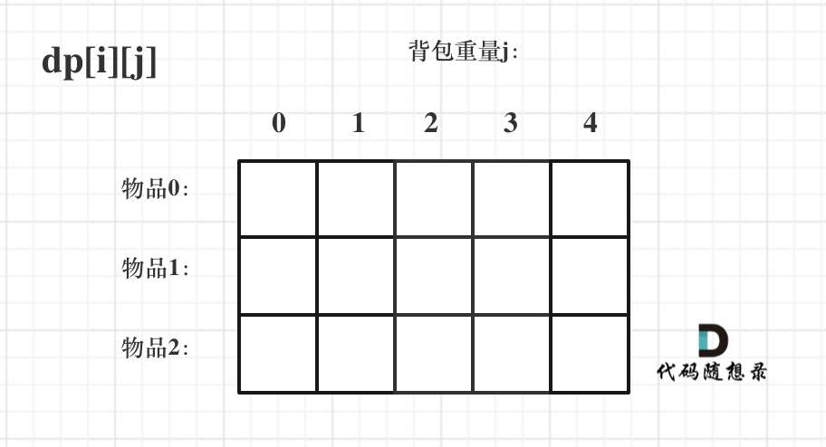

# 动规五部曲

- 确定dp数组以及下标的含义
- 确定递推公式
- dp数组如何初始化
- 确定遍历顺序
- 举例推导dp数组

# 01背包基础

## 01 背包

有n件物品和一个最多能背重量为w 的背包。第i件物品的重量是weight[i]，得到的价值是value[i] 。每件物品只能用一次，求解将哪些物品装入背包里物品价值总和最大。

## 二维dp数组01背包

有两个维度需要分别表示：物品 和 背包容量，如图，二维数组为 dp[i][j]。



i 来表示物品、j表示背包容量。

### 确定dp数组及下标的含义

dp[i][j] 表示从下标为[0-i]的物品里任意取，放进容量为j的背包，价值总和最大是多少。

### 确定递推公式

- 不放物品i：背包容量为j，里面不放物品i的最大价值是dp[i - 1][j]。
- 放物品i：背包空出物品i的容量后，背包容量为j - weight[i]，dp[i - 1][j - weight[i]] 为背包容量为j - weight[i]且不放物品i的最大价值，那么dp[i - 1][j - weight[i]] + value[i] （物品i的价值），就是背包放物品i得到的最大价值  
  递归公式： dp[i][j] = max(dp[i - 1][j], dp[i - 1][j - weight[i]] + value[i]);

### dp数组如何初始化

可以看出i 是由 i-1 推导出来，那么i为0的时候就一定要初始化。dp[0][j]，即：i为0，存放编号0的物品的时候，各个容量的背包所能存放的最大价值。

- 很明显当 j < weight[0]的时候，dp[0][j] 应该是 0，因为背包容量比编号0的物品重量还小。
- 当j >= weight[0]时，dp[0][j] 应该是value[0]，因为背包容量放足够放编号0物品。

### 确定遍历顺序

先遍历 物品还是先遍历背包重量呢？其实都可以！！ 但是先遍历物品更好理解。

虽然两个for循环遍历的次序不同，但是dp[i][j]所需要的数据就是左上角，不影响dp[i][j]公式的推导！

### 举例推导dp数组

...

```java
public class Main {
    public static int knapsack(int[] weight, int[] value, int bagWeight) {
        int n = weight.length;
        int[][] dp = new int[n][bagWeight + 1];

        for (int j = weight[0]; j <= bagWeight; j++) {
            dp[0][j] = value[0];
        }

        // i为物品，从1开始，因为0已经初始化过了
        for (int i = 1; i < n; i++) {
            // j 为背包容量，从0开始遍历
            for (int j = 0; j <= bagWeight; j++) {
                if (j < weight[i]) {
                    dp[i][j] = dp[i - 1][j];
                } else {
                    dp[i][j] = Math.max(dp[i - 1][j], dp[i - 1][j - weight[i]] + value[i]);
                }
            }
        }

        return dp[n - 1][bagWeight];
    }
}
```

## 一维dp数组01背包

对于背包问题其实状态都是可以压缩的。

- 在使用二维数组的时候，递推公式：dp[i][j] = max(dp[i - 1][j], dp[i - 1][j - weight[i]] + value[i]);
- 其实可以发现如果把dp[i - 1]那一层拷贝到dp[i]上，表达式完全可以是：dp[i][j] = max(dp[i][j], dp[i][j - weight[i]] + value[i]);
- 与其把dp[i - 1]这一层拷贝到dp[i]上，不如只用一个一维数组了，只用dp[j]。

### 确定dp数组及下标的含义

在一维dp数组中，dp[j]表示：容量为j的背包，所背的物品价值可以最大为dp[j]。

### 确定递推公式

二维dp数组的递推公式为： dp[i][j] = max(dp[i - 1][j], dp[i - 1][j - weight[i]] + value[i]);

一维dp数组，其实就上上一层 dp[i-1] 这一层 拷贝的 dp[i]来。所以在 上面递推公式的基础上，去掉i这个维度就好。

递推公式为：dp[j] = max(dp[j], dp[j - weight[i]] + value[i]);

dp[j]有两个选择：一个是取自己dp[j] 相当于 二维dp数组中的dp[i-1][j]，即不放物品i，一个是取dp[j - weight[i]] + value[i]，即放物品i，指定是取最大的，毕竟是求最大价值。

### dp数组如何初始化

dp[j]表示：容量为j的背包，所背的物品价值可以最大为dp[j]，那么dp[0]就应该是0，因为背包容量为0所背的物品的最大价值就是0。

### 确定遍历顺序

```java
for(int i = 0; i < weight.size(); i++) { // 遍历物品
    for(int j = bagWeight; j >= weight[i]; j--) { // 遍历背包容量
        dp[j] = max(dp[j], dp[j - weight[i]] + value[i]);
    }
}
```

倒序遍历是为了保证物品i只被放入一次！。但如果一旦正序遍历了，那么物品0就会被重复加入多次！

另外代码中是先遍历物品嵌套遍历背包容量，因为一维dp的写法，背包容量一定是要倒序遍历，如果遍历背包容量放在上一层，那么每个dp[j]就只会放入一个物品，即：背包里只放入了一个物品。所以一维dp数组的背包在遍历顺序上和二维其实是有很大差异的！，这一点一定要注意。

### 举例推导dp数组

。。。

```java
public class Main {
    public static int knapsack(int[] weight, int[] value, int bagWeight) {
        int n = weight.length;
        int[] dp = new int[bagWeight + 1];

        // 遍历物品
        for (int i = 0; i < n; i++) {
            // 背包容量倒序遍历（保证每件物品只放一次）
            for (int j = bagWeight; j >= weight[i]; j--) {
                dp[j] = Math.max(dp[j], dp[j - weight[i]] + value[i]);
            }
        }

        return dp[bagWeight];
    }
}
```

# 完全背包

有N件物品和一个最多能背重量为W的背包。第i件物品的重量是weight[i]，得到的价值是value[i] 。每件物品都有无限个（也就是可以放入背包多次），求解将哪些物品装入背包里物品价值总和最大。

完全背包和01背包问题唯一不同的地方就是，每种物品有无限件。

## 二维dp解法

### 确定dp数组以及下标的含义

dp[i][j] 表示从下标为[0-i]的物品，每个物品可以取无限次，放进容量为j的背包，价值总和最大是多少。

### 确定递推公式

不放物品i：背包容量为j，里面不放物品i的最大价值是dp[i - 1][j]。

放物品i：背包空出物品i的容量后，背包容量为j - weight[i]，dp[i][j - weight[i]] 为背包容量为j - weight[i]且不放物品i的最大价值，那么dp[i][j - weight[i]] + value[i] （物品i的价值），就是背包放物品i得到的最大价值

递推公式： dp[i][j] = max(dp[i - 1][j], dp[i][j - weight[i]] + value[i]);

### dp数组如何初始化

首先从dp[i][j]的定义出发，如果背包容量j为0的话，即dp[i][0]，无论是选取哪些物品，背包价值总和一定为0。

状态转移方程 dp[i][j] = max(dp[i - 1][j], dp[i][j - weight[i]] + value[i]); 可以看出有一个方向 i 是由 i-1 推导出来，那么i为0的时候就一定要初始化。

dp[0][j]，即：存放编号0的物品的时候，各个容量的背包所能存放的最大价值。

那么很明显当 j < weight[0]的时候，dp[0][j] 应该是 0，因为背包容量比编号0的物品重量还小。

当j >= weight[0]时，dp[0][j] 如果能放下weight[0]的话，就一直装，每一种物品有无限个。

```java
for (int i = 1; i < weight.size(); i++) {  // 当然这一步，如果把dp数组预先初始化为0了，这一步就可以省略，但很多同学应该没有想清楚这一点。
    dp[i][0] = 0;
}

// 正序遍历，如果能放下就一直装物品0
for (int j = weight[0]; j <= bagWeight; j++) {
      dp[0][j] = dp[0][j - weight[0]] + value[0];
}
```

### 确定遍历顺序

01背包二维DP数组，先遍历物品还是先遍历背包都是可以的。因为两种遍历顺序，对于二维dp数组来说，递推公式所需要的值，二维dp数组里对应的位置都有。

```java
for (int i = 1; i < n; i++) { // 遍历物品
    for(int j = 0; j <= bagWeight; j++) { // 遍历背包容量
        if (j < weight[i]) dp[i][j] = dp[i - 1][j];
        else dp[i][j] = max(dp[i - 1][j], dp[i][j - weight[i]] + value[i]);
    }
}
```

### 举例推导dp数组

.....

```java
public class Main {
    public static int knapsack(int[] weight, int[] value, int bagWeight) {
        int n = weight.length;
        int[][] dp = new int[n][bagWeight + 1];

        // 初始化
        for (int j = weight[0]; j <= bagWeight; j++) {
            dp[0][j] = dp[0][j - weight[0]] + value[0];
        }

        // 动态规划
        for (int i = 1; i < n; i++) {
            for (int j = 0; j <= bagWeight; j++) {
                if (j < weight[i]) {
                    dp[i][j] = dp[i - 1][j];
                } else {
                    dp[i][j] = Math.max(dp[i - 1][j], dp[i][j - weight[i]] + value[i]);
                }
            }
        }

        return dp[n - 1][bagWeight];
    }
}
```

## 一维数组dp

### 确定dp数组以及下标的含义

dp[j]表示容量为j的背包，所能装下的最大价值

### 确定递推公式

dp[j]可以通过以下两种情况取最大值得到：

不放物品i：dp[j]保持不变

放物品i：dp[j - weight[i]] + value[i]

递推公式：dp[j] = max(dp[j], dp[j - weight[i]] + value[i])

### dp数组如何初始化

容量为0的背包最大价值为0，所以 dp[0] = 0,其他容量初始化为0，因为要取最大值

### 确定遍历顺序

关键：先遍历物品，再正序遍历背包容量

```java
for (int i = 0; i < n; i++) {  // 遍历物品
    for (int j = weight[i]; j <= bagWeight; j++) {  // 正序遍历背包容量
        dp[j] = Math.max(dp[j], dp[j - weight[i]] + value[i]);
    }
}
```

为什么正序遍历？

- 完全背包中每个物品可以选多次。
- 正序遍历时，dp[j - weight[i]]使用的是本轮更新过的值。
- 这意味着物品i可能已经被选过，可以实现重复选择。

### 举例推导dp数组

....

```java
public class Main {
    public static int knapsack(int[] weight, int[] value, int bagWeight) {
        int n = weight.length;
        int[] dp = new int[bagWeight + 1];

        // 遍历物品
        for (int i = 0; i < n; i++) {
            // 正序遍历背包容量（允许物品重复选择）
            for (int j = weight[i]; j <= bagWeight; j++) {
                dp[j] = Math.max(dp[j], dp[j - weight[i]] + value[i]);
            }
        }

        return dp[bagWeight];
    }
}
```

# 背包问题总结对比

## 四种写法对比

| 写法 | 物品使用 | 递推公式 | 初始化 | 遍历顺序 | 关键点 |
| --- | --- | --- | --- | --- | --- |
| 01 · 二维 | 每件 1 次 | `dp[i][j]=max(dp[i-1][j], dp[i-1][j-w]+v)` | `dp[0][j]`：`j<w[0]`→0，`j≥w[0]`→`v[0]` | 物品/背包皆可 | 取上一行 |
| 01 · 一维 | 每件 1 次 | `dp[j]=max(dp[j], dp[j-w]+v)` | 全 0 | 物品外层，背包 **倒序** | 倒序防重复放 |
| 完全 · 二维 | 每件无限次 | `dp[i][j]=max(dp[i-1][j], dp[i][j-w]+v)` | `dp[0][j]`：`j<w[0]`→0，`j≥w[0]`→`dp[0][j-w[0]]+v[0]` | 物品/背包皆可 | 取本行，可重复 |
| 完全 · 一维 | 每件无限次 | `dp[j]=max(dp[j], dp[j-w]+v)` | 全 0 | 物品外层，背包 **正序** | 正序允重复放 |

## 组合数 vs 排列数

在完全背包的一维写法中，两层 for 循环的先后顺序，决定了求的是「组合」还是「排列」：

| 目标  | 外层循环 | 内层循环 | 说明              |
| --- | ---- | ---- | --------------- |
| 组合数 | 物品   | 背包容量 | 物品顺序固定，同一组合只算一次 |
| 排列数 | 背包容量 | 物品   | 不同顺序算不同方案       |

- 求**组合数**：外层 for 遍历物品，内层 for 遍历背包（例：#518 零钱兑换 II）
- 求**排列数**：外层 for 遍历背包，内层 for 遍历物品（例：#377 组合总和 IV）

## 一句话记忆

- 01 与完全的唯一区别：**物品能否重复选**。
- 一维写法下：**01 倒序、完全正序** —— 倒序保证每件只放一次，正序允许重复放。
- 二维写法下：01 取 `dp[i-1][...]`（上一行），完全取 `dp[i][...]`（本行）。
